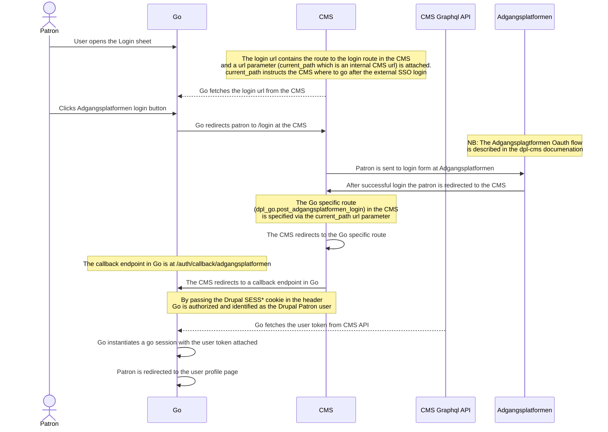
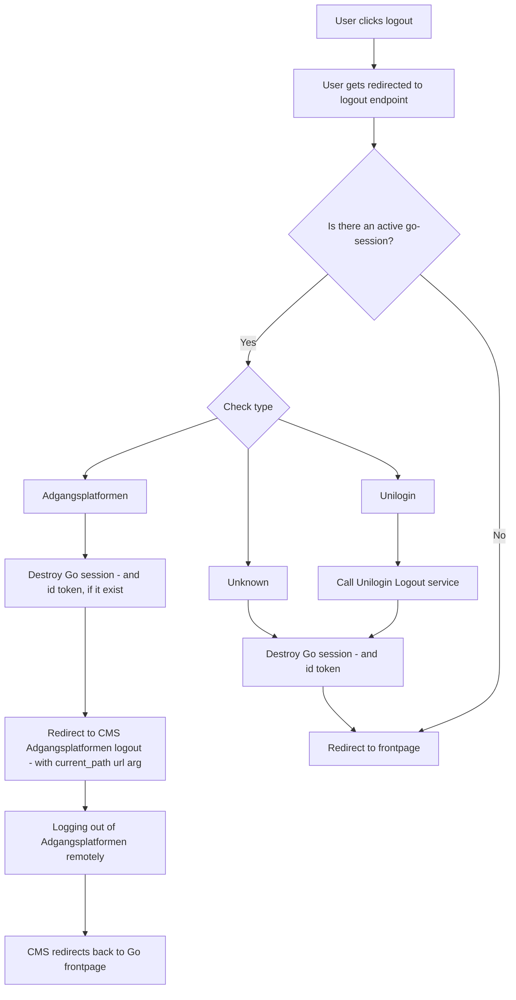

# Authentication

## General

There are two ways of logging into the Go application:

- Via [Adgangsplatformen](https://danbib.dk/login)
- Via [Unilogin](https://viden.stil.dk/display/OFFSKOLELOGIN/Unilogin)

## Go session

The Go session is maintained by using the [iron-session](https://www.npmjs.com/package/iron-session) tool.
The session data is stored in a cookie encrypted and is only readable server side.
The session architecture was decided upon as a part of developing the Unilogin
login flow which is documented in the XXX ADR.
The go session cookie is used for patrons logging in with either Unilogin or
Adgangsplatformen and has two major attributes:

**isLoggedIn** - can be either `true` or `false`

and

**type** - can be either:

- `anonymous`
- `unilogin`
- `adgangsplatformen`

The overall authorization behavior of the Go application is controlled by these
parameters.

## Login

### Login via Adgangsplatformen

## Logout

When a user click logout we need to handle that the current session either can be:

- Adgangsplatformen
- Unilogin
- Anonymous
- In a, for some reason, broken state

This chart shows how we handle the various types:

