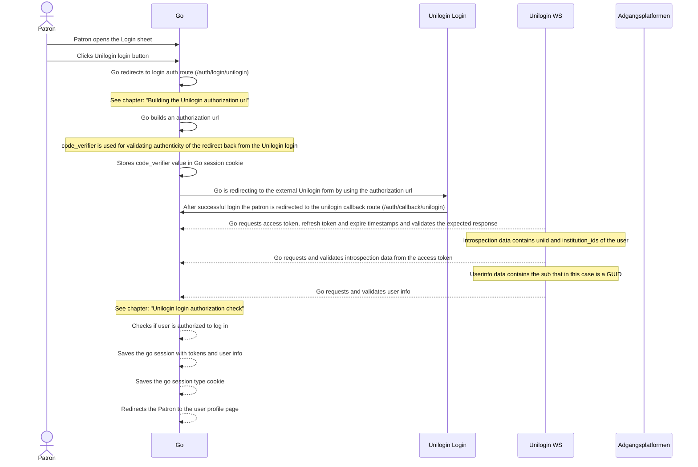
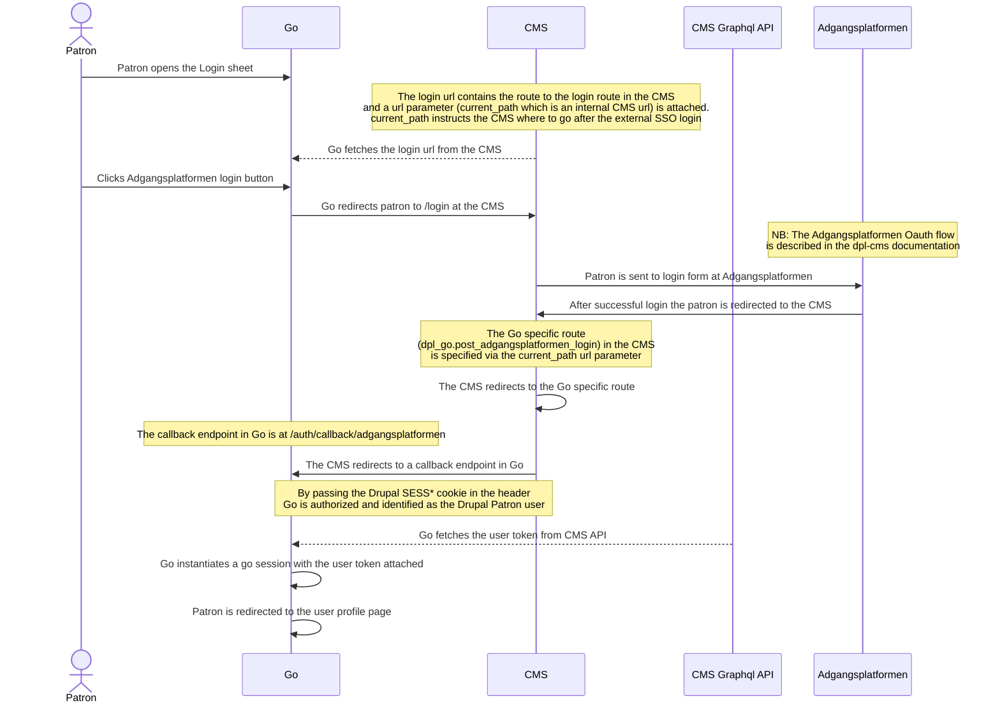
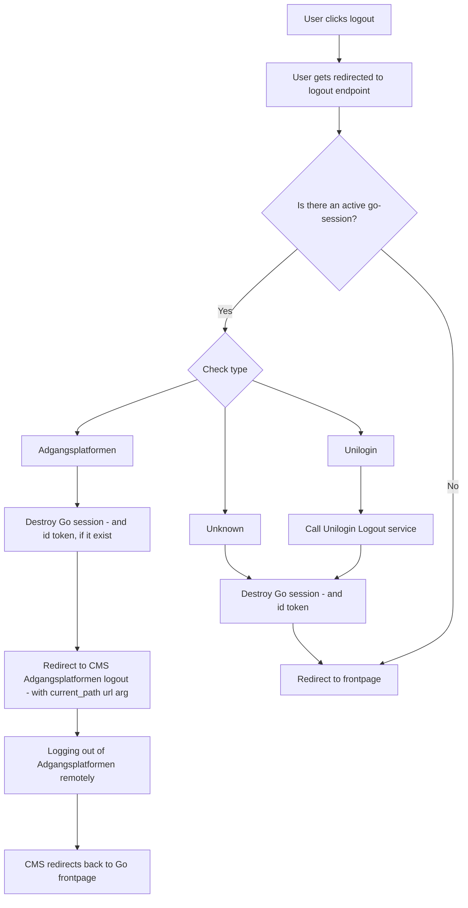

# Authentication

## General

There are two ways of logging into the Go application:

- Via [Adgangsplatformen](https://danbib.dk/login)
- Via [Unilogin](https://viden.stil.dk/display/OFFSKOLELOGIN/Unilogin)

## Go session

The Go session is maintained by using the [iron-session](https://www.npmjs.com/package/iron-session)
tool.
The session data is stored in a cookie encrypted and is only readable server side.
The session architecture was decided upon as a part of developing the Unilogin
login flow which is documented in an [ADR](https://adr.github.io/) in the docs/architecture section.
The go session cookie is used for patrons logging in with either Unilogin or
Adgangsplatformen and has two major attributes:

**isLoggedIn** - can be either `true` or `false`

and

**type** - can be either:

- `anonymous`
- `unilogin`
- `adgangsplatformen`

The overall authorization behavior of the Go application is controlled by these
parameters.

## Go session type cookie

Because we need a different behavior of the application depending of the session
type ("unilogin" or "adgangsplatformen") and we don't want to call our session
endpoint every time we decided to create a cookie called "go-session:type". Since
it is not sensitive data we can make it accessible both client and server side.
The cookie is for instance used to decide whether we need to contacting our own
Pubhub API or the Publizon adapter when requesting Publizon data.

## Login

### Login via Unilogin

The login flow is mainly controlled via the [openid-client](https://www.npmjs.com/package/openid-client)
package. It is a tool to ease the setup of the Oauth 2 flows.
The decision behind the choice of tools for the login handling is described in an
[ADR](https://adr.github.io/) in the docs/architecture section.

#### Building the Unilogin authorization url

In order to follow the Oauth2 standard and the Unilogin [STIL specification](https://viden.stil.dk/display/OFFSKOLELOGIN/Implementering+af+tjeneste)
an authorization url is constructed with the help of the openid-client tool.

A PKCE code verifier is generated (the `GO_SESSION_SECRET` is used as salt).

The code verifier is stored in the session for future validation of the
authenticity of the request from Unilogin coming back from the external login form.

And the code verifier is also used in order to create the code challenge needed
as an url parameter for the authorization url.

#### Unilogin login authorization check

As a part of the Unilogin flow when coming back form a successful login we check
if the municipality id (`kommunenr`) of the first institution in the userinfo
matches the one that is configured to the site (`UNILOGIN_MUNICIPALITY_ID`).
If the id's are identical the user is allowed to login in otherwise a logout is
forced both in the SSO and locally.

### Login via Adgangsplatformen

## Logout

When a user click logout we need to handle that the current session either can be:

- Adgangsplatformen
- Unilogin
- Anonymous
- In a, for some reason, broken state

This chart shows how we handle the various types:

## Token handling

### Token types

We have four different token types:

- Access token
- Refresh token
- Id token
- Library token

#### Access token

Access tokens exist in both Unilogin and Adgangsplatformen session.
The Unilogin access token is only used to get user information as a part
of the login process but apart from that is is not used in the rest of the application.

The Adgangsplatformen access token is a part of the `go-session` iron-session cookie.
Whenever a fetch is fired and service requested needs an Adgangsplatformen access
token as bearer token, the access token is fetched from the internal
`/auth/session` route.

#### Refresh token

Is used as a part of the Unilogin session. When access token is expired
the refresh token is used to issue a new access token.

#### Id token

Is used when a user logs out of an active Unilogin session to terminate the
remote SSO session.
See the `handleUniloginLogout()` function.

#### Library token

The documentation of the library token does not really belong here since it is
not a part of the session or authentication process.
But since we document all the token here it is worth mentioning.

The library token is fetched regularly in the middleware and set as a cookie.
Whenever it expired a new library token is fetched and the cookie is updated.
As mentioned before it is a separate system and not coupled to the session handling.
