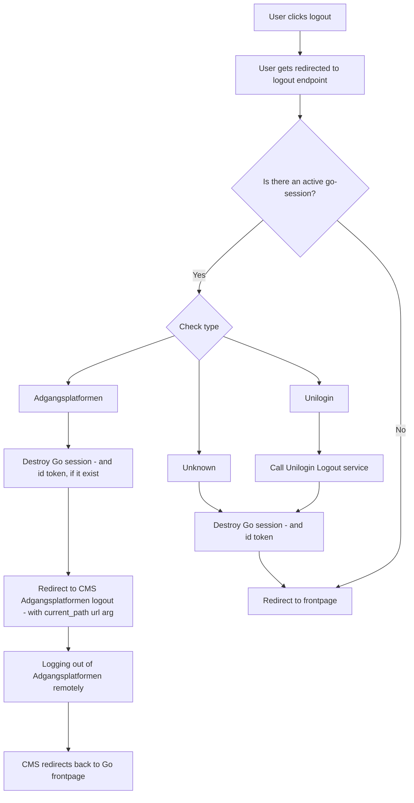

# Authentication

## Logout

When a user click logout we need to handle that the current session either can be:

- Adgangsplatformen
- Unilogin
- Anonymous
- In a, for some reason, broken state

This chart shows how we handle the various types:

