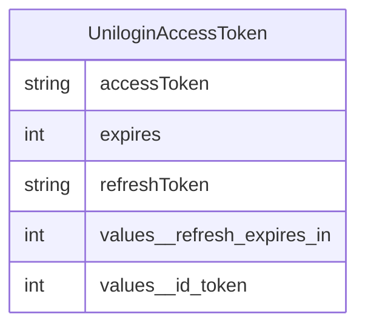
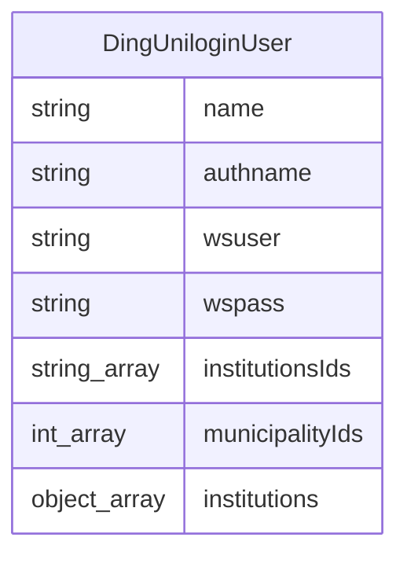
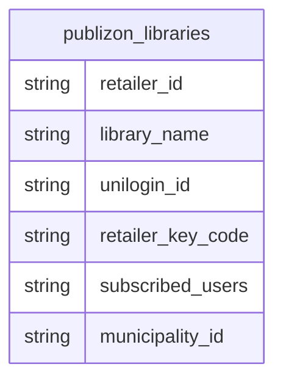
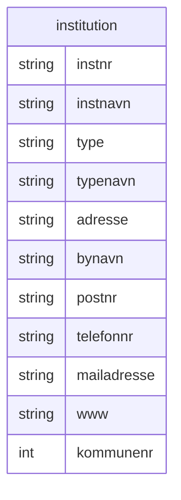
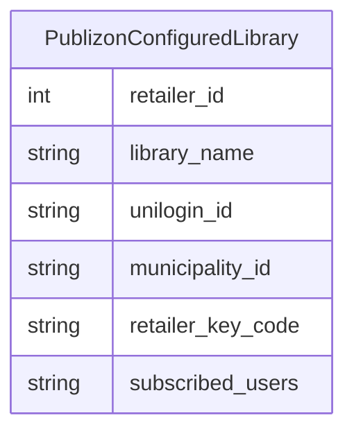
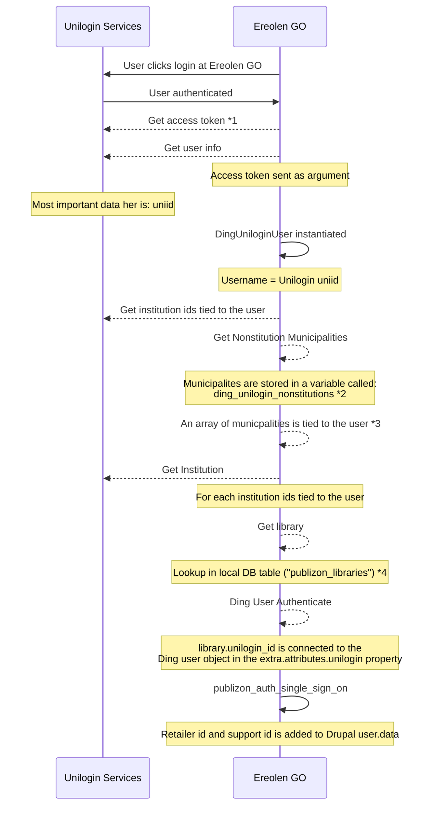

# Session handling



# DingUniloginUser



`name` is the same as the Unilogin username

# Publizon Libraries (local db table)



# Institutions og municipalities



## institutionIds

Institution ids are collected via the `DingUniloginWSIbruger` client via `hentBrugersInstitutionsTilknytninger` SOAP service

## municipalitiesIds

Municipalities is only represented as id's.

Municipalities are fetched via the `DingUniloginUser::getInstitutionMunicipalities(institutionIds)` method:

- Fake municipalities are established via `_ding_unilogin_get_nonstitution_municipalities` that gets its data from: `_ding_unilogin_get_nonstitutions` that gets the institutions from a setting (variable) called: `ding_unilogin_nonstitutions`
- InstitutionIds are iterated and every institution is fetched by the `DingUniloginWSIinst` client via the `hentInstitution` service
- If a fake institution exists with current institutionId then use the `kommunenr` from that
- (side effect) `DingUniloginUser.institutions` are being populated in the iteration with the institution
- `insititution.kommunenr` is added to the `municipalityIds` array
- The `municipalityIds` array is set on `DingUniloginUser.municipalityIds`
- The `municipalityIds` array is being returned

# Library/libraries



Libraries (`PublizonConfiguredLibrary`) are stored in the db in the table: `publizon_libraries` they are fetched by the function: `publizon_get_libraries()` which keys them by `retailer_id`.

Afterwards the libraries are being filtered by the municipalities connected to the user.

## The usage/meaning of a library

If there is multiple libraries connected to the user, only the first one is being used.

The unilogin_id from the library is being tied to the Drupal user and is being used in future contexts.

# Services

## Unilogin services

### Base class: DingUniloginServiceBase

Uses two methods: `call` and `callWithAuth` depending on if the request needs authentication

`callWithAuth` uses wsuser and wspasswd tied to the `DingUniloginUser` object

### DingUniloginWSIbruger (Unilogin API)

#### WSDL Url

```
https://wsibruger.unilogin.dk/wsibruger-v6/ws?WSDL
```

#### Actions

**hentBrugersInstitutionsTilknytninger**: Finds institutions connected to a user.

---

### DingUniloginWSIinst (Unilogin API)

#### WSDL Url

```
https://wsiinst.unilogin.dk/wsiinst-v5/ws?WSDL
```

#### Actions

**hentInstitution**: Loads a institution given its id.

## Publizon services

### Base class: PublizonClient

Makes sure that following params are used as well:

- ':languagecode': empty string
- ':clientid': publizon client id
- ':retailerid': retailer id tied to user (from library)
- ':retailerkeycode': retailer id tied to user (from library)

### PublizonUserClient (Publizon API)

#### Methods

##### getSupportId

**Endpoint**: get_friendly_cardnumber

**Action**: GetFriendlyCardnumber

**Params**: `pub:cardnumber` (uniid), `retailer_id` (from library)

### PublizonLoanClient (Publizon API)

#### Methods

##### createLoan

**Endpoint**: createloan.asmx

**Action**: CreateLoan

**Params**: `pub:ebookid` (isbn), `retailer_id` (from library), `pub:cardnumber` (uniid (username)), `pub:pincode` (empty), `pub:institutionid`, `pub:format` (empty string), `pub:mobipocketid` (empty string), `pub:institutionTags` (array of `pub:string` => $institution_tags (often empty))

---

##### getLibraryUserOrderList

**Endpoint**: getlibraryuserorderlist.asmx

**Action**: GetLibraryUserOrderList

**Params**: `retailer_id` (from library), `pub:cardnumber` (uniid (username))

# Login flows

## Unilogin

Login flow at Unilogin



#### 1)

It seems like the access token is primarily used to fetch userinfo about user in not in subsequent calls like: getUserLoans performLoan etc.

#### 2)

Only one nonstitution municipality is stored:

```bash
ding_unilogin_nonstitutions:
  A04441:
    institution_id: A04441
    municipality_kommunenr: '101'
    municipality_kommune: '101'
```

The municipality is represented in the `publizon_libraries` table:

```mysql
+-------------+--------------+-------------+-------------------+------------------+-----------------+
| retailer_id | library_name | unilogin_id | retailer_key_code | subscribed_users | municipality_id |
+-------------+--------------+-------------+-------------------+------------------+-----------------+
| 810         | København    | 101         | xxxxxxxx          | 26915            | 101             |
+-------------+--------------+-------------+-------------------+------------------+-----------------+
```

#### 3)

For every institution stored on user there is a `kommunenr` and is collected into a municipality array:

```php
 $municipalityIds[] = $institution->kommunenr;
```

However if an user institution is represented in `ding_unilogin_nonstitutions` the `kommunenr` is used from that.

#### 4)

Get library by looking at the kommunenr of the first institution of the user
